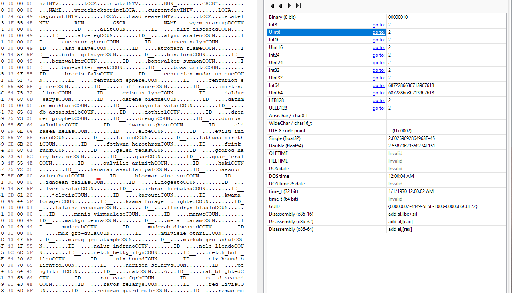

Yeah, I still play Morrowind (with OpenMW) and love to use mods like Tamriel
Rebuilt, Wyrmhaven, Beware the Sixth House, etc. In my case I installed a mod,
_on a fresh character!_, that changed buildings (Beautiful Cities of Morrowind).
Upon entering the Ald Skar Inn, whom do I find? Nobody. Nada. Bupkiss.

Weird, I thought. It was at the momentary epiphany that I started falling.
And FAST. And PASSING other unforunates.

Oh hey, it's all of the inn dwellers and we're racing to oblivion. And lo and
behold, Hassour Zainsubani is kinda important for the main quest. If he dies
Caius drops you like it's HOT and your main quest is kaput with the classic
message:

> "The path to your destiny is blocked"

I also never saw the other clear signal you're screwed:

> "With this character's death, the thread of prophecy is severed. Restore a
> saved game to restore the weave of fate, or persist in the doomed world you
> have created."

"That sucks!", "WHAT THE FUCK", "How did that happen?", "Sigghhhh.....".
Surprise, confusion, grief, acceptance. One might call these the seven
(okay not seven) stages of playing Morrowind.

### Lets fix it

Alright, you don't want to start a new character and all the snappy bitches on
reddit that tell you to do so can fuxk off. You'll need a hex editor (I use HxD
on windows) so get that or something similar if you don't have it. Also this is
for OpenMW. If you're still playing OG morrowind, switch over. You'll be happier
for it. You'll need to be able to use the console by pressing the \~ key
in-game. There are many guides and videos on youtube if you need more help.

Here's what I did:

- First, save your game as it is.
- Now, create ANOTHER save, with a filename you'll remember that signifies that
  is the one you will edit.
- Resurrect your NPC, I am using Hassour Zainsubani for example but others will
  be similar.
- Use the hex editor to reset the death count to zero.

## Resurrection

Stand where you want to place the NPC, I generally stand where they would be
before mod fuckery. Get the position and note the outputs of the commands:

```
player->GetPos x
player->GetPos y
player->GetPos z
```

You will get a numeric output for each, in my case in Ald Skar Inn they were:

```
x = 495.423950
y = -1562.035156
z = -254.999969
```

Your numbers probably won't match mine. Now move your character a few steps
away, and revive the npc.

```
"hassour zainsubani"->PositionCell, 495.423950, -1562.035156, -254.999969, 0, "Ald-ruhn, Ald Skar Inn"
```

That will spawn him, dead or alive. Or should, I guess. If he's dead, then bring
him back:

```
"hassour zainsubani"->Resurrect
```

Now that he's alive and well, save and quit the game.

## Edit death count

Find your OpenMW saves folder, for me on windows 11 it is in
`Documents\My Games\OpenMW\saves\<your character>\`.

Make a backup then open the .omwsave file that you want to edit. Search for the
name of the npc you resurrected, ie "hassour". There will be several matches,
but go until you see something resembling `hassour zainsubabiCOUN....`. The
trailing periods (representing bytes) are what we'll be editing.

Now we need to find the byte to edit. Immediately after COUN will be a number
(4 in the screenshot below, underlined in red).


Ignore that and find the *next* number, 2 as shown in the next screenshot.
Set that 2 to 0 (zero), underlined in red.



Save the file and try playing your game! If all goes well Caius won't be pissed
at you anymore. If it fails to load (expecting different numbers) then you
edited the wrong thing.

## References

Here are a few links to help find info about npc names/id (their ID is often
their name). And also a link to console command reference as well as where
I found interior cell names which you'll need to specify when running the
PositionCell command.

- https://wiki.openmw.org/index.php?title=Morrowind_Interior_Cell_Names
- http://www.gamesas.com/there-console-command-make-npc-appear-before-you-t365414.html
- https://en.uesp.net/wiki/Morrowind:Console
- https://elderscrolls.fandom.com/wiki/Hassour_Zainsubani
